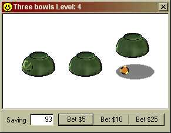



## Three Bowls

### Description

The main purpose of this program is to check how good are your eyes can be, and how long you can concentrate with some thing that moves quickly.
 
### More Info
 

             |
---                |---
**Submitted On**   |2000-09-08 11:38:50
**By**             |[Derio](https://github.com/Planet-Source-Code/PSCIndex/blob/master/ByAuthor/derio.md)
**Level**          |Beginner
**User Rating**    |5.0 (20 globes from 4 users)
**Compatibility**  |VB 5\.0, VB 6\.0
**Category**       |[Games](https://github.com/Planet-Source-Code/PSCIndex/blob/master/ByCategory/games__1-38.md)
**World**          |[Visual Basic](https://github.com/Planet-Source-Code/PSCIndex/blob/master/ByWorld/visual-basic.md)
**Archive File**   |[CODE\_UPLOAD9741982000\.zip](https://github.com/Planet-Source-Code/derio-three-bowls__1-11350/archive/master.zip)

